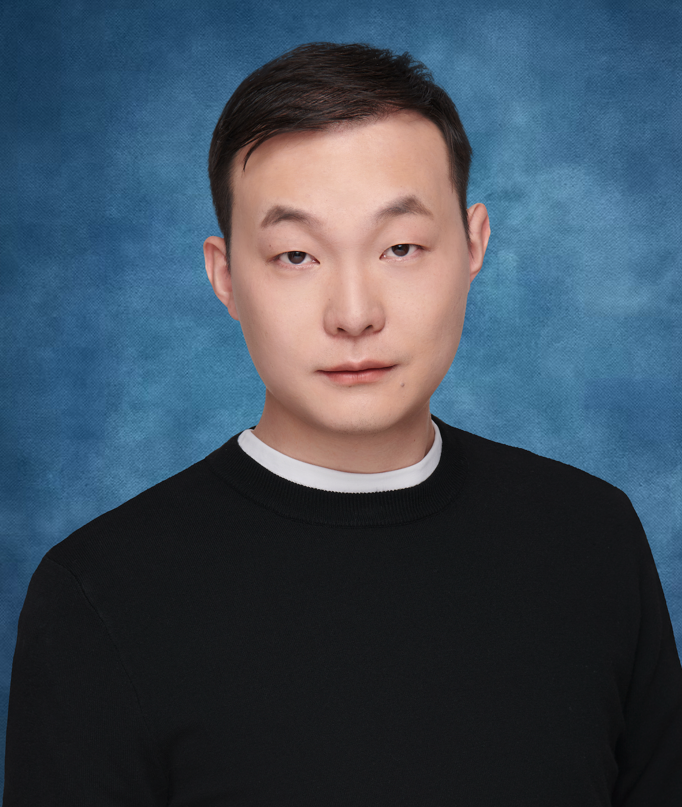
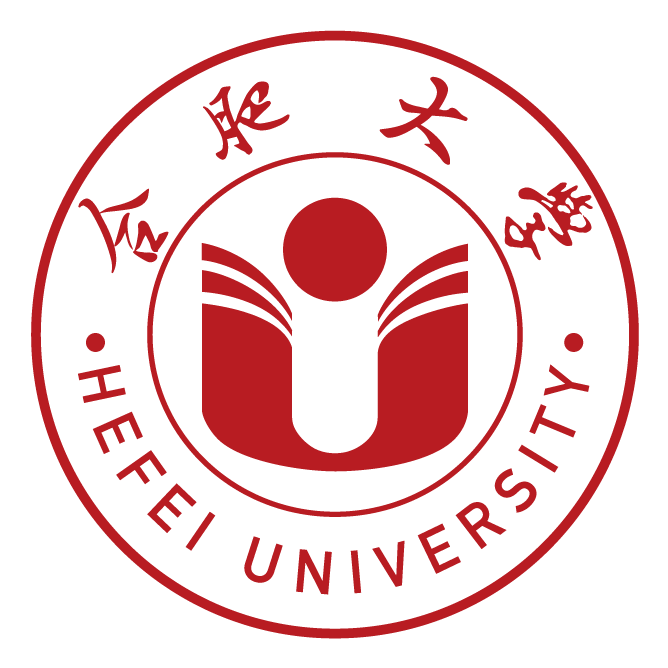

  

    <h1>Dehai Min &nbsp; 闵德海</h1>
    
👋 I am a first-year CS Ph.D. student (Aug. 2025–) at <a href="https://www.uic.edu/">University of Illinois Chicago (UIC)</a>, advised by Prof. <a href="https://lcheng.org/">Lu Cheng</a>. I received my M.S. from Southeast University, advised by Prof. <a href="https://scholar.google.com/citations?user=1gw3LJQAAAAJ&hl=en">Guilin Qi</a>, and my B.S. from Hefei University. I was also a research intern at Stony Brook University in 2024, working with Prof. <a href="https://chenyuyou.me/">Chenyu You</a>.

    
My current research interests include <strong>Retrieval-Augmented Generation (RAG) & Deep Research</strong> and <strong>Trustworthy LLMs: Uncertainty Quantification</strong>. Previously, during my master's studies, I worked on LLMs with heterogeneous data (text, graphs, and tables).

    

      <a href="mailto:dmin10@uic.edu">📧 Email</a> /
      <a href="https://scholar.google.com/citations?user=lVn0bHUAAAAJ">🎓 Google Scholar</a> /
      <a href="https://github.com/ZhishanQ">😺 Github</a> /
      <a href="https://twitter.com/qiezimin">🐦 Twitter</a>
    

  

  

    
  

## 🎉 News

<ul class="news-list">
  <li>[2025.12] New paper released: <em>QuCo-RAG</em> — Quantifying Uncertainty from the Pre-training Corpus for Dynamic RAG. <a href="https://arxiv.org/abs/2512.19134">📄 Paper</a> / <a href="https://github.com/ZhishanQ/QuCo-RAG">📦 Code</a> / Covered by <a href="https://mp.weixin.qq.com/s/2hcm6AvMxh39XS7RECjXLA">🔥 新智元</a>.</li>
  <li>[2025.12] Selected as <strong>Outstanding Reviewer of 2024–2025</strong> for IEEE TNNLS! <a href="https://zhishanq.github.io/files/TNNLS_Outstanding_reviewer_Dehai_Min.pdf">📦 Certificate</a></li>
  <li>[2025.12] New paper released: <em>MVI-Bench</em> — Evaluating Robustness to Misleading Visual Inputs in LVLMs. <a href="https://arxiv.org/abs/2511.14159">📄 Paper</a> / <a href="https://github.com/chenyil6/MVI-Bench">📦 Code</a></li>
  <li>[2025.08] Moved to Chicago 🇺🇸.</li>
  <li>[2025.01] 🎉 One paper (<a href="https://arxiv.org/abs/2410.20163">UniHGKR</a>) accepted by <strong>NAACL 2025</strong> as <strong>Oral</strong>, with the highest meta-review score of 5! <a href="https://github.com/ZhishanQ/UniHGKR">📦 Code</a> / <a href="https://huggingface.co/collections/ZhishanQ/unihgkr-6846b60973fa75b04681a388">🤗 Models & Datasets</a></li>
  <li>[2024.12] One paper accepted by <strong>AAAI 2025</strong>!</li>
</ul>

## 🎓 Education

  
  
<strong>University of Illinois Chicago</strong> , Ph.D. , <em>08/2025 - present</em>

  
  
<strong>Southeast University</strong> , M.S. , <em>09/2022 - 06/2025</em>

  
  
<strong>Hefei University</strong> , B.S. , <em>09/2017 - 06/2022</em>

## 📝 Publications and Preprints
(\* denotes equal contribution.)

  

### First-author Publications

* **Dehai Min**, Kailin Zhang, Tongtong Wu, Lu Cheng. [QuCo-RAG: Quantifying Uncertainty from the Pre-training Corpus for Dynamic Retrieval-Augmented Generation](https://arxiv.org/abs/2512.19134)  Under Review
 [📄 Paper](https://arxiv.org/abs/2512.19134) / [📦 Code](https://github.com/ZhishanQ/QuCo-RAG)  / [🔥 Media Coverage](https://mp.weixin.qq.com/s/2hcm6AvMxh39XS7RECjXLA)

* **Dehai Min**, Zhiyang Xu, Guilin Qi, Lifu Huang, and Chenyu You. [UniHGKR: Unified Instruction-aware Heterogeneous Knowledge Retrievers](https://arxiv.org/abs/2410.20163) NAACL 2025, Oral Highest Meta-Review Score: 5
 [📄 Paper](https://arxiv.org/abs/2410.20163) / [📦 Code](https://github.com/ZhishanQ/UniHGKR)  / [🤗 Models & Datasets](https://huggingface.co/collections/ZhishanQ/unihgkr-6846b60973fa75b04681a388)

* **Dehai Min**\*, Nan Hu\*, Rihui Jin, Nuo Lin, Jiaoyan Chen, Yongrui Chen, Yu Li et al. [Exploring the Impact of Table-to-Text Methods on Augmenting LLM-based Question Answering with Domain Hybrid Data](https://arxiv.org/abs/2402.12869) NAACL 2024, Oral
 [📄 Paper](https://arxiv.org/abs/2402.12869) / [🎤 Slides](https://zhishanq.github.io/files/Oral_for_NAACL_2024.pdf)

* Yiming Tan\*, **Dehai Min**\*, Yu Li, Wenbo Li, Nan Hu, Yongrui Chen, and Guilin Qi. [Can ChatGPT replace traditional KBQA models? An in-depth analysis of the question answering performance of the GPT LLM family](https://link.springer.com/chapter/10.1007/978-3-031-47240-4_19) ISWC 2023, Oral **190 Citations**
 [📄 Paper](https://link.springer.com/chapter/10.1007/978-3-031-47240-4_19) / [📦 Code](https://github.com/tan92hl/Complex-Question-Answering-Evaluation-of-GPT-family)  / [🎤 Slides](https://zhishanq.github.io/files/ISWC2023-oral_new.pdf)

### Collaborative Publications

* Mingyang Wei, **Dehai Min**, Zewen Liu, Yuzhang Xie, Guanchen Wu, Carl Yang, Max S.Y. Lau, Qi He, Lu Cheng, Wei Jin. [EpiQAL: Benchmarking Large Language Models in Epidemiological Question Answering for Enhanced Alignment and Reasoning](https://arxiv.org/abs/2601.03471) Under Review

* Huiyi Chen, Jiawei Peng, **Dehai Min**, Changchang Sun, Kaijie Chen, Yan Yan, Xu Yang, Lu Cheng. [MVI-Bench: A Comprehensive Benchmark for Evaluating Robustness to Misleading Visual Inputs in LVLMs](https://arxiv.org/abs/2511.14159) Under Review
 [📦 Code](https://github.com/chenyil6/MVI-Bench) 

* Rihui Jin, Yu Li, Guilin Qi, Nan Hu, Yuan-Fang Li, Jiaoyan Chen, Jianan Wang, Yongrui Chen, **Dehai Min** and Sheng Bi. [HeGTa: Leveraging Heterogeneous Graph-enhanced Large Language Models for Few-shot Complex Table Understanding](https://arxiv.org/abs/2403.19723) AAAI 2025

* Yu Li, Shenyu Zhang, Rui Wu, Xiutian Huang, Yongrui Chen, Wenhao Xu, Guilin Qi, and **Dehai Min**. [MATEval: A Multi-Agent Discussion Framework for Advancing Open-Ended Text Evaluation](https://arxiv.org/abs/2403.19305) DASFAA 2024, Oral

* Nan Hu, Yike Wu, Guilin Qi, **Dehai Min**, Jiaoyan Chen, Jeff Z. Pan, and Zafar Ali. [An empirical study of pre-trained language models in simple knowledge graph question answering](https://link.springer.com/article/10.1007/s11280-023-01166-y) WWW Journal 2023
 [📦 Code](https://github.com/HuuuNan/PLMs-in-Practical-KBQA) 

* Jiaqi Li, Chuanyi Zhang, Miaozeng Du, **Dehai Min**, Yongrui Chen, and Guilin Qi. [Three stream based multi-level event contrastive learning for text-video event extraction](https://aclanthology.org/2023.emnlp-main.103/) EMNLP 2023, Oral
 [🎤 Slides](https://zhishanq.github.io/files/EMNLP_2023_oral.pdf)

## 🧑‍🏫 Internship

  
Stony Brook University , <em>07/2024 - 11/2024</em> Research Intern , Advisor: <a href="https://chenyuyou.me/index.html">Chenyu You</a>

## 👨‍💻 Academic Services

* **Outstanding Reviewer of 2024–2025**, IEEE TNNLS [📦 Certificate](https://zhishanq.github.io/files/TNNLS_Outstanding_reviewer_Dehai_Min.pdf)

* Reviewer of ACL 2025/2026, EMNLP 2025, ICML 2026

* Reviewer of IEEE Transactions on Neural Networks and Learning Systems (TNNLS)

* Subreviewer of the International Semantic Web Conference (ISWC 2024)

## 🏆 Scholarships (Selected)

* **Southeast University Xiaomi Scholarship (1/98)**, *Nov. 2024*
* **Southeast University Alumni Scholarship (Top 1%)**, *Oct. 2023*
* **University-level First-class Scholarship**, *Oct. 2020*

## 🏅 Competitions
( I was an active participant in programming competitions during my undergraduate years. )

* **ACM-ICPC** (International Collegiate Programming Contest) , Asian Regional Contest (Shanghai Site and others), 2019-2020, **2 times Silver Medal**. [individual](https://zhishanq.github.io/images/ICPC_Individual.pdf) / [team](https://zhishanq.github.io/images/ICPC_Team.pdf)
* CCPC-Finals (China Collegiate Programming Contest National Finals), 2019, **21st place, Silver Medal**
* 16th Baidu Star Programming Contest, National Semi-Finals, 2019, **154th place (154/13900+)**
* Anhui Province Collegiate Programming Contest, **First Prize (2 times, 2019, 2020), Champion🏆 (1 time, 2020)**
* Codeforces Rating: **2108 (Master)**, [link](https://codeforces.com/profile/QieziMin)
